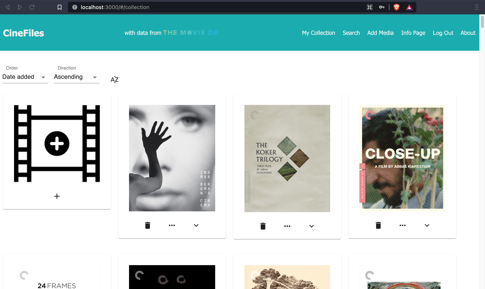
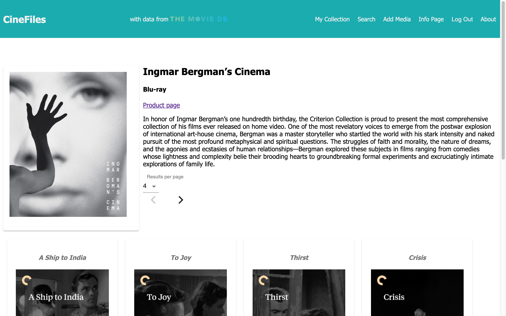
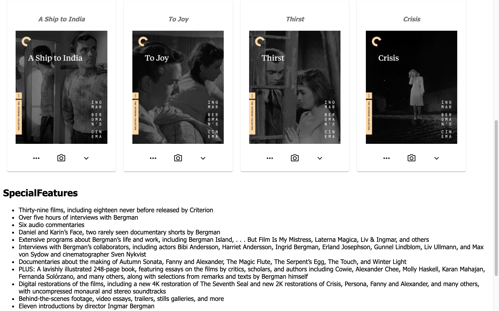
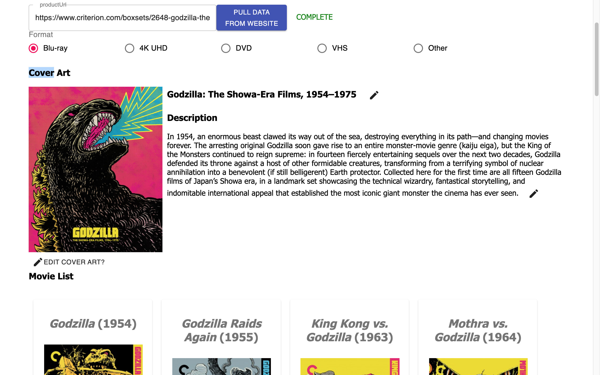
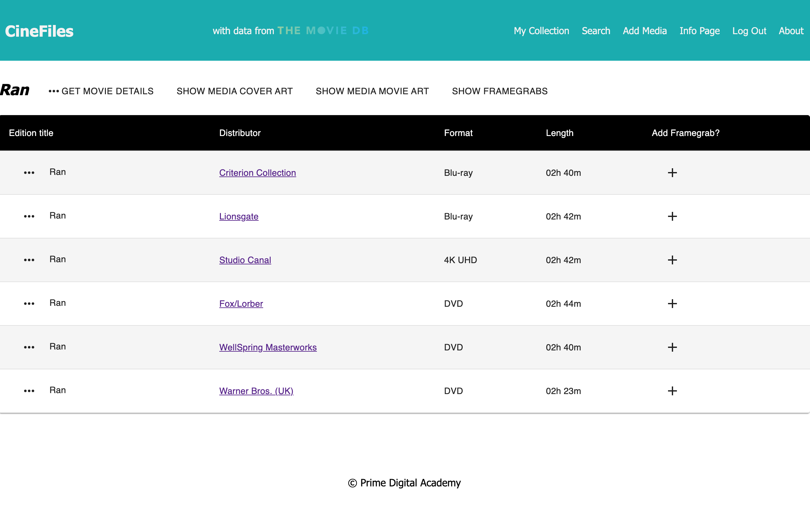
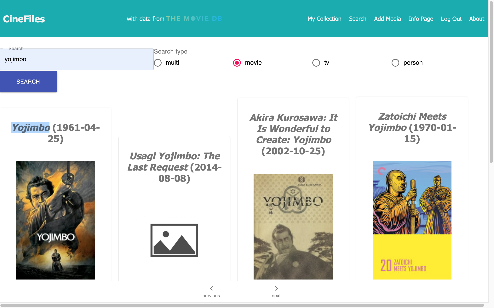
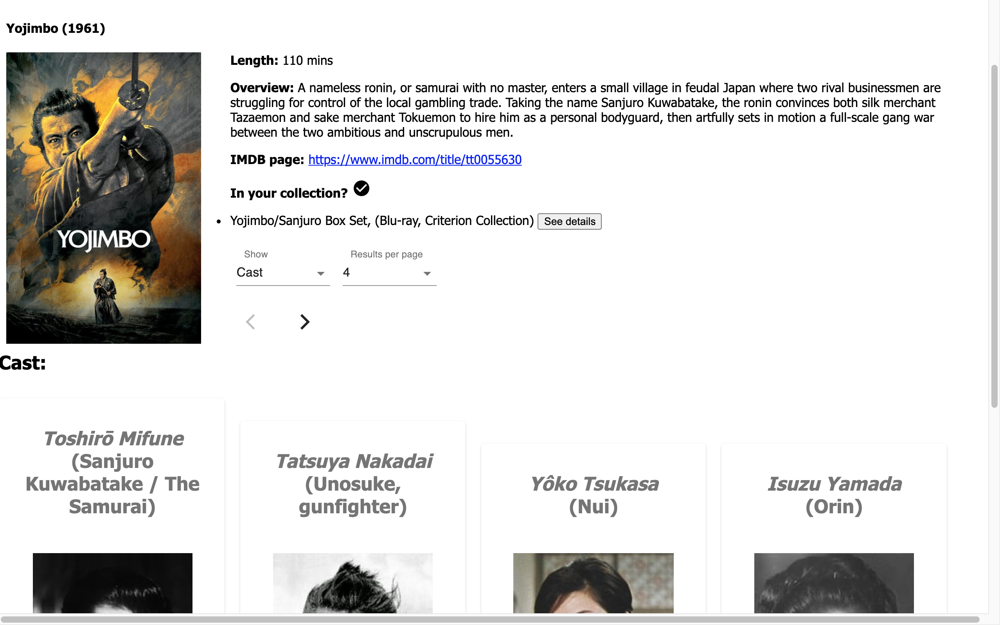
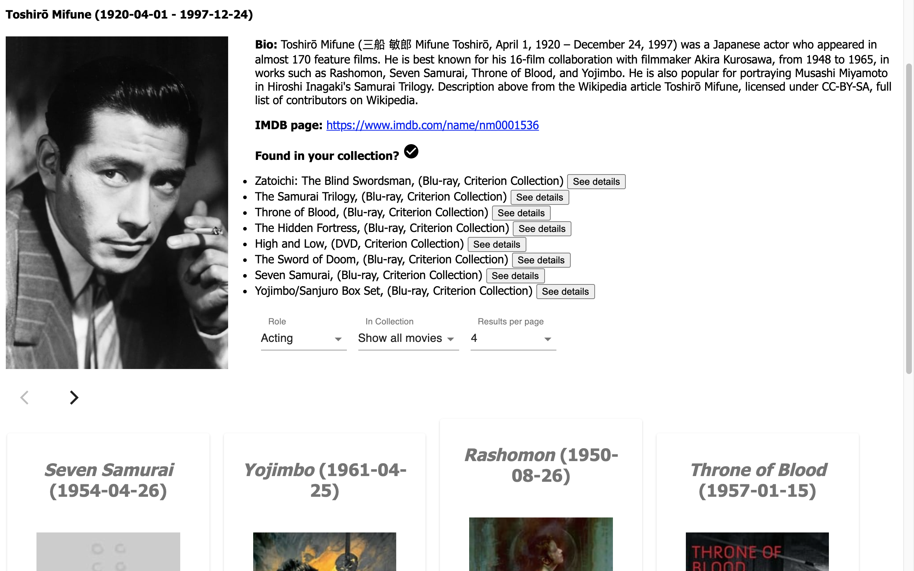

# CineFiles
An app to organize and track your movie collection, built with React, Redux, Express, Passport, and PostgreSQL (a full list of dependencies can be found in `package.json`).

CineFiles fixes shortcomings of existing movie apps by allowing users to distinguish between different edits and restorations of a movie (e.g. Lord of the Rings theatrical cuts vs extended cuts) and keep track of special features.

We **STRONGLY** recommend following these instructions carefully. It's a lot, and will take some time to set up, but your life will be much easier this way in the long run.

## Prerequisites

Before you get started, make sure you have the following software installed on your computer:

- [Node.js](https://nodejs.org/en/)
- [PostrgeSQL](https://www.postgresql.org/)
- [Nodemon](https://nodemon.io/)

## Create database and tables

Create a new database called `cinefiles` and run `/database.sql` in Postgres to populate it with the necessary tables.

ERD diagram is in the scope document. Not all tables are used in the current version of CineFiles - some are there for features I plan to add soon.

## Development Setup Instructions

- Run `npm install`
- Create a `.env` file at the root of the project
  - Add this to the `.env` file:
  ```
  SERVER_SESSION_SECRET=superDuperSecret
  ```
  Replace `superDuperSecret` with a long random string to keep your application secure. Here's a site that can help you: [https://passwordsgenerator.net/](https://passwordsgenerator.net/). If you don't do this step, create a secret with less than eight characters, or leave it as `superDuperSecret`, you will get a warning.
  - add this line to the `.env` file
  ```
  TMDB_API_KEY=tmdbApiKey
  ```
  Replace `tmdbApiKey` with an API key from TMDB. You will need to request one on [their website](https://developers.themoviedb.org/3/getting-started/introduction). Their API is free to use as long as you give them credit.
- Start postgres if not running already by using `brew services start postgresql`
- Run `npm run server`
- Run `npm run client`
- Navigate to `localhost:3000`

## Project Screenshots

#### Collection Page

- Display all movies in current user's collection
- Sort by name, date added, distributor, or format
- Remove an item from your collection, see a description of the item, or go to Item Details Page
- Go to Add Media Page

#### Item Details Page

- Display box art, title, format, link to product page, and description of item


- Display name and art for all movies in a collection
  - Link to Movie Page and Edition Comparison Page
  - Show/hide movie summary and other details
- List Special Features

#### Add Media Page

- Manually enter name, title, description, cover art, movies, special features
- Enter item's URL from the distributor website and CineFiles will webscrape all the relevant data (Currently only supported for Criterion Collection movies and box sets)

#### Edition Comparison Page

- Side by side comparisons of different editions of the same movie
  - List distributor, format, length
  - Show/hide cover art for the movie or box set
- Show/hide framegrabs and timestamps for all editions to allow easy side-by-side comparison of image quality
- Add framegrab
- Link to Item Details Page for each edition
- Link to Movie Page

#### Search Page

- Search for a movie, tv show, person, or multi-search
- Paginated search results showing name, date, and art
- Show/hide description
- link to Movie Page

#### Movie Page

- Display name, year, length, summary art, imdb link
- List all items in your collection which contain this movie and link to Item Details Page
- Display cast names, characters, photographs and crew names, roles, and photographs for all cast and crew, paginated or all on one page
- Link to Person Page

#### Person Page

- Display name, birth and death dates, bio, link to imdb page, and all items in your collection which this person was involved in with links to Item Details page
- Display all movies person was involved in and allow user to filter by what role they played and whether or not the movie is in user collection
- Paginate or show all movies
- Show/hide plot summaries
- Link to Movie Page

## Debugging

To debug, you will need to run the client-side separately from the server. Start the client by running the command `npm run client`. Start the debugging server by selecting the Debug button.


Then make sure `Launch Program` is selected from the dropdown, then click the green play arrow.


## Testing Routes with Postman

To use Postman with this repo, you will need to set up requests in Postman to register a user and login a user at a minimum.

Keep in mind that once you using the login route, Postman will manage your session cookie for you just like a browser, ensuring it is sent with each subsequent request. If you delete the `localhost` cookie in Postman, it will effectively log you out.

1. Start the server - `npm run server`
2. Import the sample routes JSON file [v2](./PostmanPrimeSoloRoutesv2.json) by clicking `Import` in Postman. Select the file.
3. Click `Collections` and `Send` the following three calls in order:
   1. `POST /api/user/register` registers a new user, see body to change username/password
   2. `POST /api/user/login` will login a user, see body to change username/password
   3. `GET /api/user` will get user information, by default it's not very much

After running the login route above, you can try any other route you've created that requires a logged in user!

## Production Build

Before pushing to Heroku, run `npm run build` in terminal. This will create a build folder that contains the code Heroku will be pointed at. You can test this build by typing `npm start`. Keep in mind that `npm start` will let you preview the production build but will **not** auto update.

- Start postgres if not running already by using `brew services start postgresql`
- Run `npm start`
- Navigate to `localhost:5000`

## Lay of the Land

There are a few videos linked below that show a walkthrough the client and sever setup to help acclimatize to the boilerplate. Please take some time to watch the videos in order to get a better understanding of what the boilerplate is like.

- [Initial Set](https://vimeo.com/453297271)
- [Server Walkthrough](https://vimeo.com/453297212)
- [Client Walkthrough](https://vimeo.com/453297124)

Directory Structure:

- `src/` contains the React application
- `public/` contains static assets for the client-side
- `build/` after you build the project, contains the transpiled code from `src/` and `public/` that will be viewed on the production site
- `server/` contains the Express App

This code is also heavily commented. We recommend reading through the comments, getting a lay of the land, and becoming comfortable with how the code works before you start making too many changes. If you're wondering where to start, consider reading through component file comments in the following order:

- src/components
  - App/App
  - Footer/Footer
  - Nav/Nav
  - AboutPage/AboutPage
  - InfoPage/InfoPage
  - UserPage/UserPage
  - LoginPage/LoginPage
  - RegisterPage/RegisterPage
  - LogOutButton/LogOutButton
  - ProtectedRoute/ProtectedRoute

## Deployment

1. Create a new Heroku project
1. Link the Heroku project to the project GitHub Repo
1. Create an Heroku Postgres database
1. Connect to the Heroku Postgres database from Postico
1. Create the necessary tables
1. Add an environment variable for `SERVER_SESSION_SECRET` with a nice random string for security
1. In the deploy section, select manual deploy

## Update Documentation

Customize this ReadMe and the code comments in this project to read less like a starter repo and more like a project. Here is an example: https://gist.github.com/PurpleBooth/109311bb0361f32d87a2
